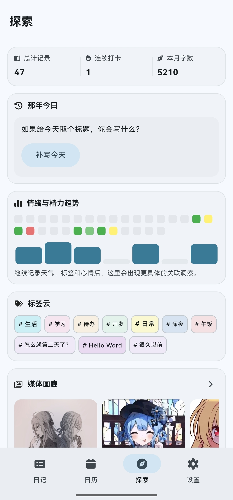
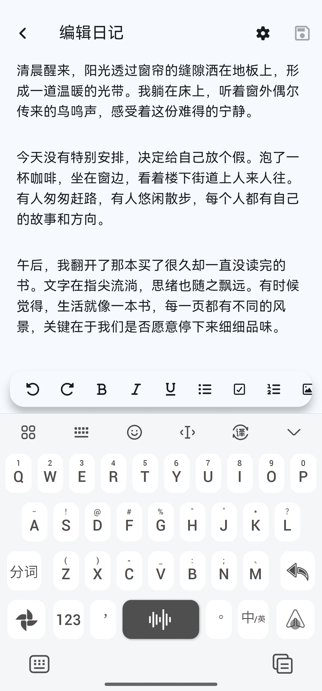
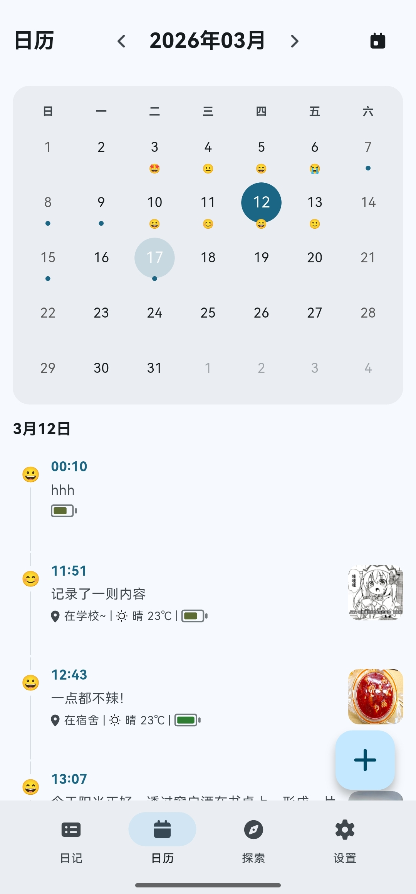

# Jot - 简单私密的本地日记本

[English](./docs/README.en.md) | 简体中文

Jot 是一款完全免费、开源的本地日记应用。开发这款应用的初衷很简单：希望能有一个没有任何广告打扰、不用强制注册账号、不需要连网就能使用的纯粹记录工具。

在这里，你可以安心地记录每天的心情、随手的灵感或是生活流水账。你的所有日记和照片都只存放在你自己的手机里，完全由你自己掌控。

## 📱 界面预览

  
  &nbsp;&nbsp;
  
  &nbsp;&nbsp;
  

## 🌟 核心功能

### ✍️ 纯粹的写作体验

极简的界面设计，支持图文混排，让你专注于写字本身。

### 🏷️ 自动记录环境信息

不只是一段文字。在你写日记时，应用可以获取当前天气和位置信息（需授权），你也可以手动调整。  
同时支持记录心情 Emoji 与精力状态，方便后续回顾。

### 📅 日历与回忆

日历视图会根据你每天的记录展示状态。通过“那年今日”能力，你可以轻松翻看历史同期记忆。

### 🔒 绝对的隐私安全

- 完全本地化：没有云端服务器，日记数据默认不上传。
- 应用锁：支持系统生物认证/设备认证解锁，保护隐私。
- 数据导出：支持加密打包导出，方便你自行备份到电脑或网盘。

## 📥 下载与安装

> ⚠️ 注：Jot 当前处于早期版本，暂时仅支持 Android，后续支持更多设备。

安装方式：

1. 进入项目 Releases 页面：  
   [https://github.com/CikeSeven/jotsy/releases](https://github.com/CikeSeven/jotsy/releases)
2. 下载最新的安装包。
3. 如果你不知道下载哪一个，建议下载 `arm64-v8a` 版本。

## 💬 常见问题

### Q: 换新手机了，日记怎么迁移？

A: 由于应用是纯本地存储，不会自动云同步。请在旧手机“设置”中使用“导出备份”生成备份文件，传到新手机后再通过“导入备份”恢复数据。

### Q: 为什么获取不到天气和定位？

A: 请检查是否授予了位置信息权限，以及网络是否正常。位置信息仅用于当前日记展示，不会用于上传轨迹。

## 🐛 反馈与建议

如果你遇到 Bug，或有新功能建议，欢迎到 GitHub Issues 反馈：  
[https://github.com/CikeSeven/jotsy/issues](https://github.com/CikeSeven/jotsy/issues)
